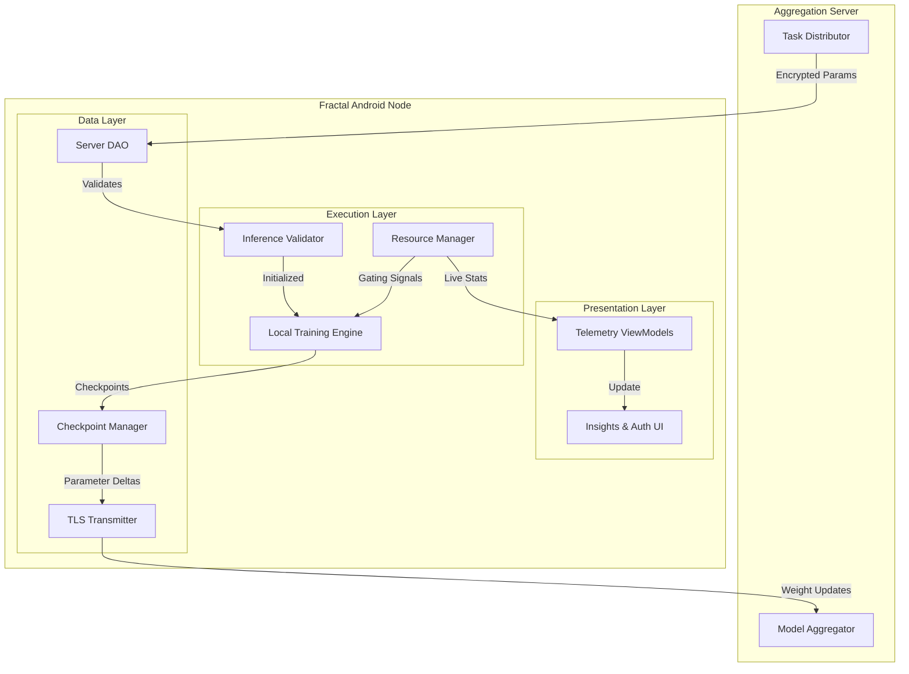
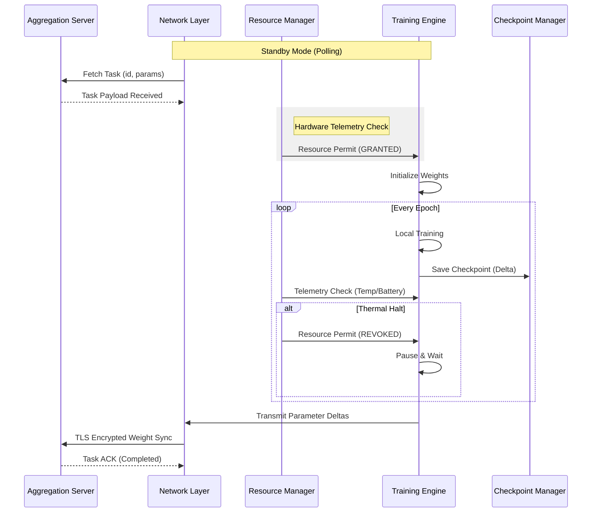

<div align="center">


# Fractal

**A Human-Centric, Resource-Aware Edge Computing & Federated Learning Node for Android**

[](https://kotlinlang.org)
[](https://developer.android.com/studio)
[](#)
[](LICENSE)
[](https://github.com/Ahmad-Hassan-0/Fractal-Application/actions/workflows/android.yml)

---

**Empowering devices, preserving privacy, and bridging the gap between machine intelligence and human experience.**

[Philosophy](#philosophy) • [Architecture](#architecture-overview) • [System Flow](#system-workflow) • [Onboarding](#getting-started) • [Contributing](#contributing)

</div>

---

## Overview

**Fractal** is an advanced Android client designed to transform mobile devices into autonomous compute nodes within a distributed federated network. By localizing compute-heavy machine learning tasks, Fractal ensures that sensitive data remains exactly where it belongs: with the user.

In an era of centralized AI, Fractal represents a shift toward **Empathetic Engineering**. The system is built to respect the host device’s primary purpose—serving the human user. Through rigorous hardware telemetry gating, background operations are dynamically managed to ensure zero impact on device performance, thermal comfort, or battery longevity.

---

## Philosophy

### Human-Centric Edge Computing
The "Fractal" name reflects the project's vision: small, self-similar units of intelligence that, when combined, create a complex and powerful whole. 
*   **Privacy by Default**: Data never leaves the device. Only mathematical insights (weights) are shared.
*   **Resource Empathy**: The software "feels" the device's strain. If the phone gets warm or the battery drops, Fractal steps back.
*   **Democratic AI**: Decentralizing compute power gives individuals control over the future of distributed intelligence.

---

## Architecture Overview

Fractal is engineered with a strict decoupling of telemetry monitoring, execution engines, and presentation layers. This ensures stability and modularity at scale.

> [!TIP]
> For a comprehensive, low-level technical breakdown of the system's internal wiring, the [Master Architecture Diagram](docs/diagrams/architecture.drawio) is available. This file can be viewed or edited using [app.diagrams.net](https://app.diagrams.net/).



---

## System Workflow

### The Data Lifecycle
The following flow illustrates how a single training task progresses from discovery to completion while maintaining hardware safety.



---

## Internal Module Structure

<details>
<summary><b>View Detailed Repository Map</b></summary>

```text
Fractal-Application/
├── app/src/main/java/
│   ├── AppBackend/
│   │   ├── DataManager/          # Caching & DTO initialization
│   │   ├── LocalTrainingModule/  # TFLite Training & Checkpointing
│   │   ├── Network/              # Secure DAOs & Transmitters
│   │   ├── ResourceManagement/   # Thermal & CPU Telemetry logic
│   │   ├── TaskContainer/        # Payload parsing (Image_Task)
│   │   └── Validator/            # Accuracy & Inference verification
│   ├── AppFrontend/
│   │   ├── Auth/                 # Secure Binding & Registration
│   │   ├── Home/                 # Real-time Training Dashboard
│   │   ├── Insights/             # Telemetry & Performance Charts
│   │   └── Settings/             # Global Node Configuration
│   └── AppGlobal/                # Cross-cutting Utilities & Configs
├── docs/assets/                  # Project visuals & logos
└── build.gradle.kts              # Modern Kotlin DSL Build Config
```

</details>

---

## Technical Pipeline

| Pipeline Stage | Implementation | Key Responsibility |
| :--- | :--- | :--- |
| **Ingress** | `Server_DAO` | Task polling with backoff and TLS payload decryption. |
| **Gating** | `OperationControl` | Multi-variable telemetry analysis (Thermal, SoC, RAM). |
| **Execution** | `Image_Trainer` | On-device gradient descent using optimized TFLite kernels. |
| **Persistence** | `CheckpointManager` | Fault-tolerant serialization of intermediate training states. |
| **Egress** | `ModelTransmitter` | Payload compression and encrypted delta synchronization. |

---

## Development & Build Pipeline

### Prerequisites
* **Environment**: Android Studio Jellyfish (2023.3.1+)
* **SDK**: Min API 24 / Target API 34
* **Physical Device**: Required for accurate telemetry feedback loops.

### Build Workflow
```bash
# 1. Clone the project
git clone https://github.com/Ahmad-Hassan-0/Fractal-Application.git

# 2. Sync Gradle dependencies
./gradlew build

# 3. Deploy to hardware
./gradlew installDebug
```

### CI/CD Status
Fractal utilizes GitHub Actions to ensure code quality:
- **Build Verification**: Automatic compilation check on all PRs.
- **Linting**: Kotlin style guide enforcement.
- **Artifact Generation**: Debug builds archived for rapid testing.

---

## Contributing

New contributors are welcomed to the Fractal ecosystem. Please review the [Contributing Guidelines](CONTRIBUTING.md) and [Code of Conduct](CODE_OF_CONDUCT.md) to maintain a collaborative and respectful environment.

- **Bug Reports**: Standardized templates are available in the issues tab.
- **Feature Requests**: Proposals for architectural improvements are encouraged.
- **Security**: Please refer to the [Security Policy](SECURITY.md) for vulnerability disclosure.

---

## Credits

### Lead Architect
**Ahmad Hassan (B-Ted)**
*Primary architecture, core engine development, and system design.*

### Community
Fractal is maintained and improved by its growing community of contributors.

---

<div align="center">
<i>Driven by Privacy. Powered by the Edge. Built for Humans.</i><br>
Licensed under [MIT](LICENSE).
</div>
