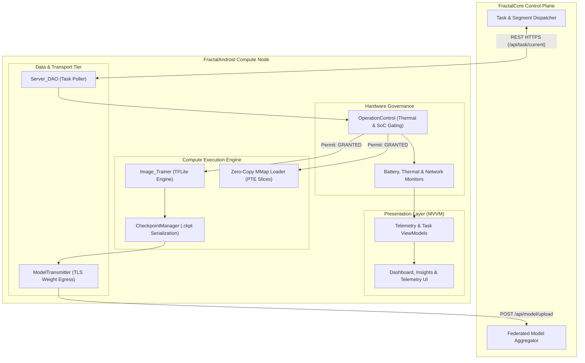
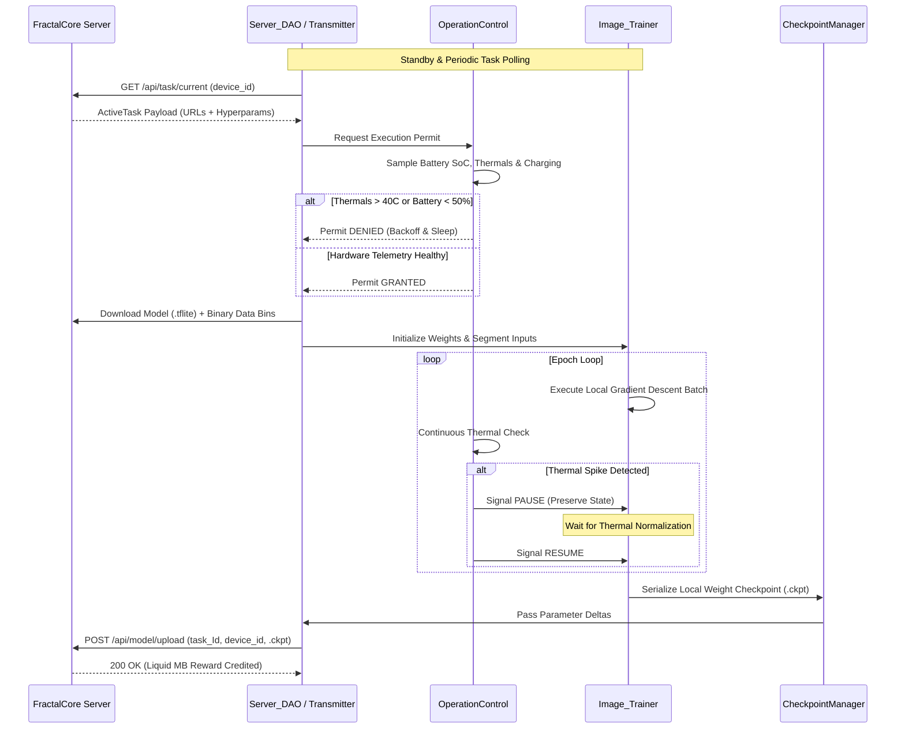

<div align="center">


# FractalAndroid
### Resource-Aware Edge Compute Node and Mobile Execution Engine

[](https://kotlinlang.org)
[](https://developer.android.com/studio)
[](#)
[](LICENSE)
[](https://github.com/Fractal-Compute-Orchestrations/FractalAndroid/actions/workflows/android.yml)

**FractalAndroid is the distributed compute client and edge execution runtime for the Fractal decentralized intelligence framework.**

[Overview](#overview) | [Architecture](#system-architecture) | [Telemetry Gating](#hardware-telemetry-gating) | [Execution Lifecycle](#execution-lifecycle) | [Module Map](#module-breakdown) | [Build & Setup](#development-and-build)

---
</div>

## Overview

FractalAndroid turns Android mobile devices into autonomous, privacy-preserving compute nodes within the Fractal distributed network. Operating in coordination with the central server (**FractalCore**), the application executes localized machine learning workloads—including on-device federated training (TFLite) and partitioned foundation model inference (ExecuTorch)—without exposing user data or degrading host device performance.

The client is designed with strict resource empathy: the engine continuously monitors physical hardware telemetry (SoC temperature, battery level, charging status, RAM pressure) and dynamically gates computation to guarantee zero impact on user experience or battery longevity.

---

## System Architecture

The client application follows a decoupled Model-View-ViewModel (MVVM) architecture with strict separation between UI telemetry rendering, hardware gating controllers, execution runtimes, and network synchronization layers.



---

## Hardware Telemetry Gating

The client enforces strict multi-variable gating via `OperationControl` before and during computation:

```text
+------------------------+--------------------------+-------------------------------------+
| Telemetry Parameter    | Operational Threshold    | Action on Violation                 |
+------------------------+--------------------------+-------------------------------------+
| Battery State-of-Charge| Level >= 50% or Charging | Workload paused until connected     |
| Battery Temperature    | Temp <= 40.0 C           | Execution paused until cooled       |
| Network Connectivity   | Unmetered Wi-Fi          | Checkpoint upload deferred          |
| Memory Pressure        | System Memory Low == False| Zero-copy mmap bypasses ART heap   |
+------------------------+--------------------------+-------------------------------------+
```

---

## Execution Lifecycle

The lifecycle of a single federated compute round on the mobile client proceeds through automated telemetry checks, training execution, and encrypted checkpoint transmission.



---

## Module Breakdown

```text
FractalAndroid/
|-- app/src/main/java/
|   |-- AppBackend/
|   |   |-- DataManager/             # Dataset binary segment parsing and caching
|   |   |-- LocalTrainingModule/     # TFLite Gradient Descent, Image_Trainer
|   |   |-- Network/                 # Server_DAO, ModelTransmitter (TLS HTTP)
|   |   |-- ResourceManagement/      # OperationControl, Battery & Thermal Telemetry
|   |   |-- TaskContainer/           # ActiveTask DTOs and JSON serialization
|   |   `-- Validator/               # Accuracy validation & inference assertions
|   |-- AppFrontend/
|   |   |-- Auth/                    # Node Registration & Binding UI
|   |   |-- Home/                    # Real-Time Compute & Training Dashboard
|   |   |-- Insights/                # Real-Time Telemetry & Hardware Charts
|   |   `-- Settings/                # Target Server URL & Threshold Configuration
|   `-- AppGlobal/                   # Cross-cutting Constants & Utility Helpers
|-- build.gradle.kts                 # Root Kotlin DSL Build Configuration
|-- app/build.gradle.kts             # Application Module Build Configuration
`-- docs/                            # Architecture Diagrams (.drawio) and Assets
```

---

## Technical Pipeline Specifications

| Pipeline Stage | Java/Kotlin Implementation | Responsibility |
| :--- | :--- | :--- |
| **Ingress** | `Server_DAO` | Polling task endpoints with exponential backoff and payload decoding. |
| **Gating** | `OperationControl` | Real-time multi-variable telemetry gating (Thermal, Battery, RAM). |
| **Execution** | `Image_Trainer` | On-device gradient calculation using optimized TFLite mobile kernels. |
| **Memory Map** | `PteLoader` (ExecuTorch) | Zero-copy virtual memory mapping (`mmap`) of partitioned `.pte` slices. |
| **Persistence** | `CheckpointManager` | Serialization of intermediate parameter matrices. |
| **Egress** | `ModelTransmitter` | Encrypted transmission of `.ckpt` parameter updates to FractalCore. |

---

## Development and Build

### Prerequisites
- **Android Studio**: Version 2023.3.1 (Jellyfish) or newer
- **Android SDK**: Compile SDK 34, Min SDK 24
- **JDK**: Java 17 (recommended for Gradle 8+)
- **Physical Device**: Required for physical thermal and hardware sensor feedback loops

### Build Workflow

```bash
# 1. Clone the repository
git clone https://github.com/Fractal-Compute-Orchestrations/FractalAndroid.git
cd FractalAndroid

# 2. Build Debug APK
./gradlew assembleDebug

# 3. Execute Unit Tests
./gradlew test

# 4. Install and Run on Connected Device
./gradlew installDebug
```

---

## Security & Privacy Guarantee

- **Zero Data Exfiltration**: Raw user data (images, local sensor feeds) remains confined to local storage. Only mathematical parameter checkpoints are sent to the server.
- **Hardware Protection**: Strict thermal and battery limits prevent device stress or accelerated battery degradation.
- **TLS Egress Encryption**: All communications with FractalCore occur over HTTPS/TLS.

---

## Governance

FractalAndroid is an open-source project architected by **[Ahmad Hassan (B-Ted)](https://github.com/Fractal-Compute-Orchestrations)**.

- Contributing: See [CONTRIBUTING.md](CONTRIBUTING.md)
- Code of Conduct: See [CODE_OF_CONDUCT.md](CODE_OF_CONDUCT.md)
- Security Policy: See [SECURITY.md](SECURITY.md)
- License: Open-source under the [MIT License](LICENSE)
