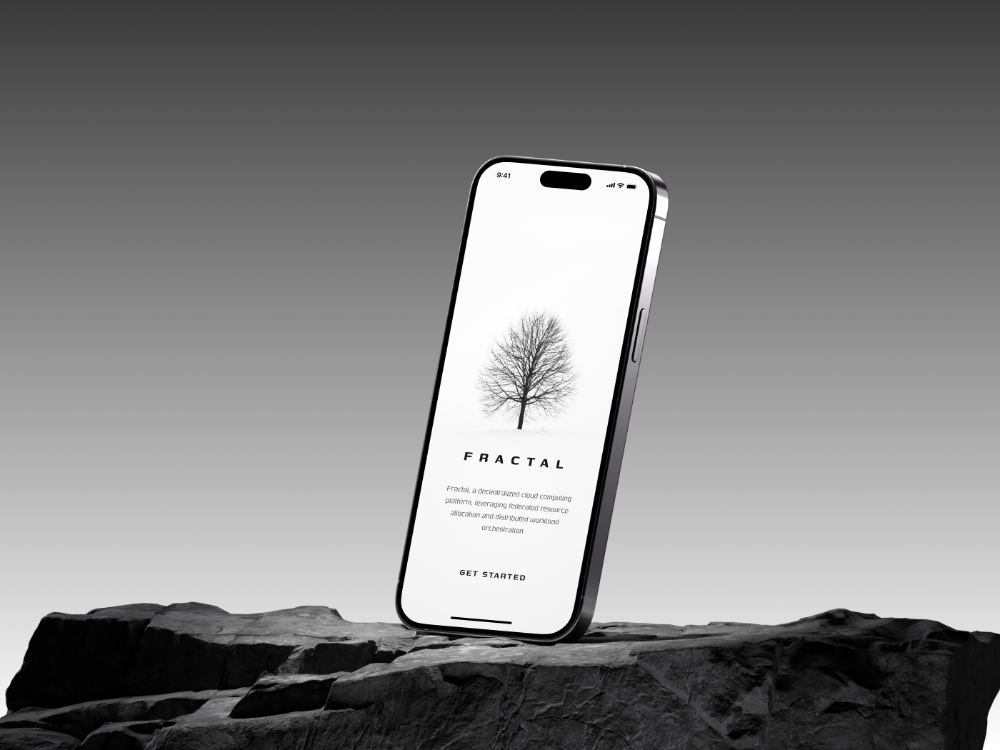
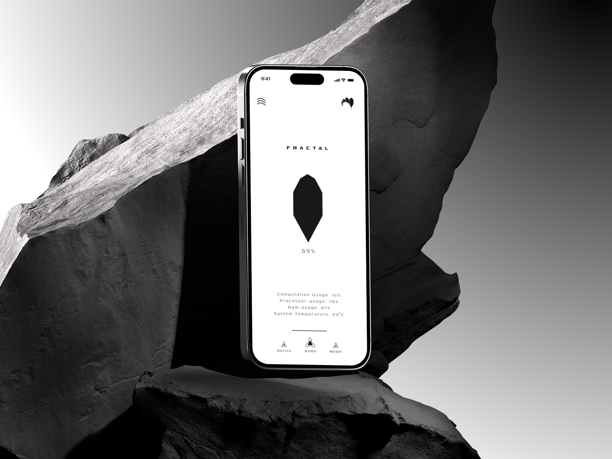
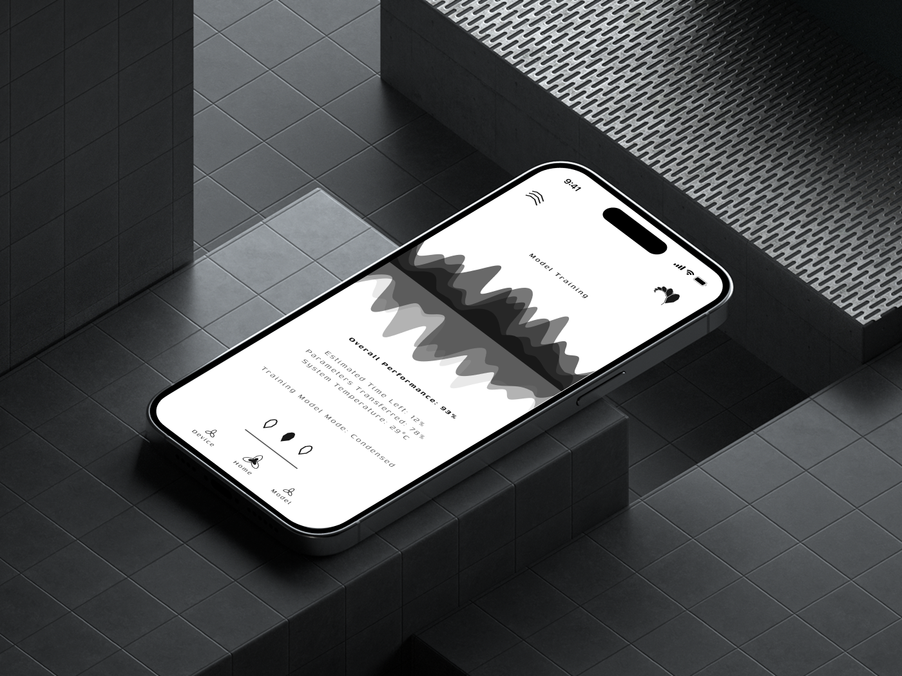
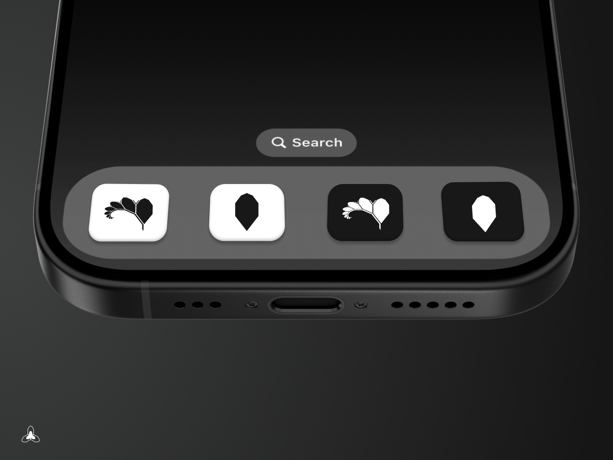
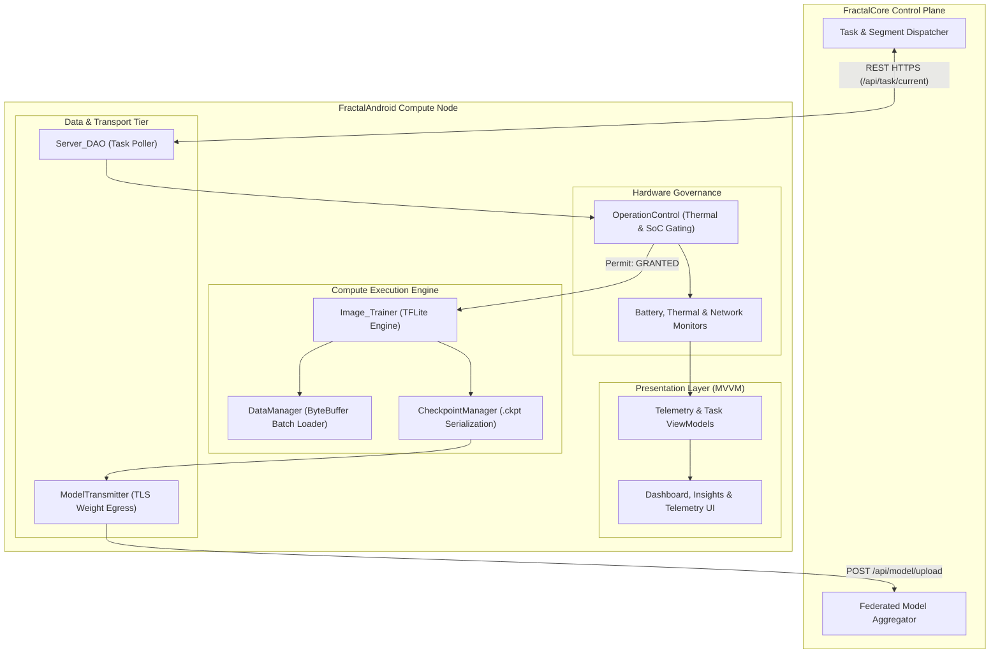
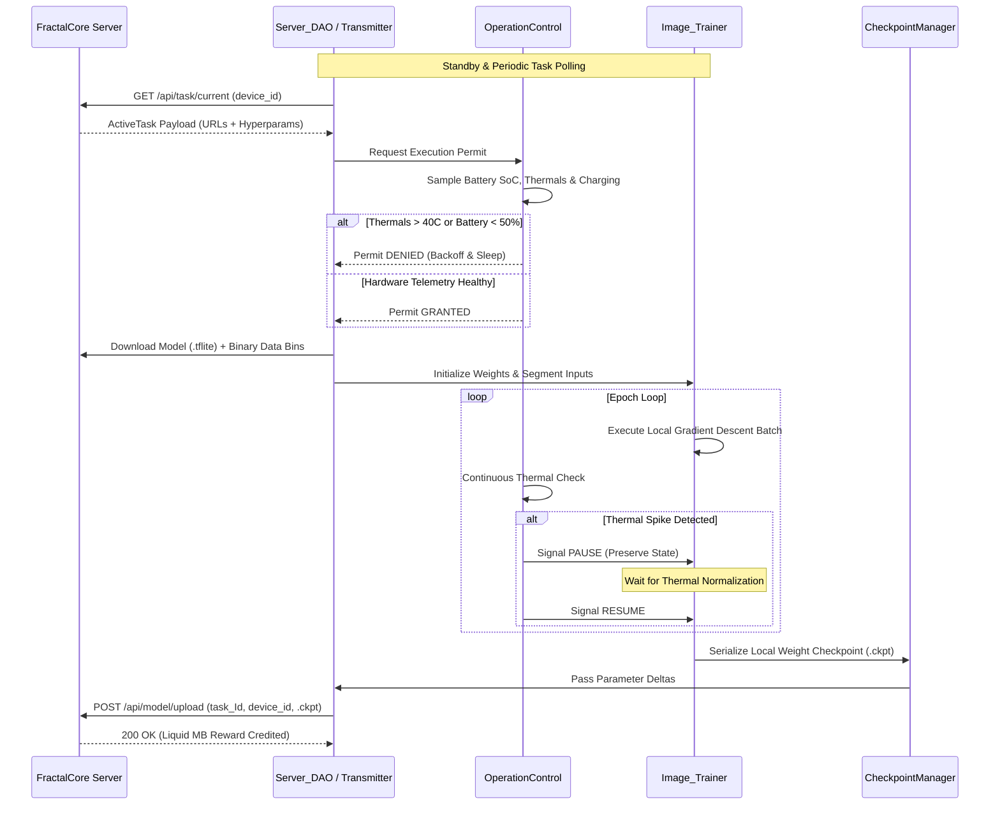

<div align="center">



# FractalAndroid
### Resource-Aware Edge Compute Node and Mobile Execution Engine

[](https://kotlinlang.org)
[](https://developer.android.com/studio)
[](https://www.behance.net/gallery/221459335/Fractal)
[](#)
[](LICENSE)
[](https://github.com/Fractal-Compute-Orchestrations/FractalAndroid/actions/workflows/android.yml)

**FractalAndroid is the distributed compute client and edge execution runtime for the Fractal decentralized intelligence framework.**

[Overview](#overview) | [Design Showcase](#mobile-ui-design--hardware-showcase) | [App UI Tour](#mobile-application-interface) | [WiFi Bank Rewards](#wifi-bank--bandwidth-rewards) | [Design Case Study](https://www.behance.net/gallery/221459335/Fractal) | [Architecture](#system-architecture) | [Telemetry Gating](#hardware-telemetry-gating) | [Lifecycle](#execution-lifecycle) | [Build & Setup](#development-and-build)

---
</div>

## Overview

FractalAndroid turns Android mobile devices into autonomous, privacy-preserving compute nodes within the Fractal distributed network. Operating in coordination with the central server (**FractalCore**), the application executes localized machine learning workloads—including on-device federated training (TFLite) and partitioned batch dataset training—without exposing user data or degrading host device performance.

The client is designed with strict resource empathy: the engine continuously monitors physical hardware telemetry (SoC temperature, battery level, charging status, RAM pressure) and dynamically gates computation to guarantee zero impact on user experience or battery longevity.

---

## Mobile UI Design & Hardware Showcase

<table>
  <tr>
    <td width="25%" align="center"></td>
    <td width="25%" align="center"></td>
    <td width="25%" align="center"></td>
    <td width="25%" align="center"></td>
  </tr>
  <tr>
    <td align="center"><sub><b>Active Compute Node</b><br>Live training telemetry & diamond meter</sub></td>
    <td align="center"><sub><b>Model Training Metrics</b><br>Performance curves & parameter transfer</sub></td>
    <td align="center"><sub><b>Platform Architecture</b><br>Decentralized cloud & studio identity</sub></td>
    <td align="center"><sub><b>Dock Iconography</b><br>Light & dark adaptive icon variants</sub></td>
  </tr>
</table>

---

## Mobile Application Interface

### 1. Onboarding, Device Authorization & Binding
<table>
  <tr>
    <td width="33.3%" align="center"></td>
    <td width="33.3%" align="center"></td>
    <td width="33.3%" align="center"></td>
  </tr>
  <tr>
    <td align="center"><sub><b>Get Started:</b> Platform onboarding introducing the decentralized compute harvesting paradigm.</sub></td>
    <td align="center"><sub><b>Device Authorization:</b> Firebase auth & hardware ID binding (`ANDROID_ID`, CPU, RAM).</sub></td>
    <td align="center"><sub><b>Registered Info:</b> Confirmed registration profile and assigned compute node telemetry.</sub></td>
  </tr>
</table>

### 2. Node Fleet States & Real-Time Compute
<table>
  <tr>
    <td width="33.3%" align="center"></td>
    <td width="33.3%" align="center"></td>
    <td width="33.3%" align="center"></td>
  </tr>
  <tr>
    <td align="center"><sub><b>Home (Standby / Inactive):</b> Idle state awaiting task assignment with live hardware monitors.</sub></td>
    <td align="center"><sub><b>Home (Active Compute):</b> Active local training with pulsing fractal diamond indicator.</sub></td>
    <td align="center"><sub><b>Node Settings & Preferences:</b> Autonomous telemetry thresholds and charging policies.</sub></td>
  </tr>
</table>

### 3. Telemetry, Analytics & Training Insights
<table>
  <tr>
    <td width="33.3%" align="center"></td>
    <td width="33.3%" align="center"></td>
    <td width="33.3%" align="center"></td>
  </tr>
  <tr>
    <td align="center"><sub><b>Usage Insights:</b> Time-series telemetry graphs for CPU, RAM, battery, and thermals.</sub></td>
    <td align="center"><sub><b>Device Insights:</b> Detailed hardware profiling with one-tap memory optimization.</sub></td>
    <td align="center"><sub><b>Model Training:</b> Live loss convergence curves, parameter transfer rates, and epoch progress.</sub></td>
  </tr>
</table>

---

## WiFi Bank & Bandwidth Rewards

Fractal transforms idle consumer mobile hardware into active decentralized compute infrastructure through a fair, transparent reward exchange:

- **Edge Compute Contribution**: When connected to power and unmetered Wi-Fi, the Android node executes quantized gradient descent or model slice inference.
- **Liquid Bandwidth Credits (WiFi Bank)**: Every validated parameter checkpoint (`.ckpt`) uploaded to FractalCore automatically credits liquid MBs to the device's account via the Firestore ledger.
- **Bandwidth Redemption**: Users can redeem their accumulated data credits directly for high-speed Wi-Fi access or shared bandwidth pools.

<table>
  <tr>
    <td width="14.2%" align="center"></td>
    <td width="14.2%" align="center"></td>
    <td width="14.2%" align="center"></td>
    <td width="14.2%" align="center"></td>
    <td width="14.2%" align="center"></td>
    <td width="14.2%" align="center"></td>
    <td width="14.2%" align="center"></td>
  </tr>
  <tr>
    <td align="center"><sub><b>0.0 GB</b><br>Initial / Empty</sub></td>
    <td align="center"><sub><b>0.5 GB</b><br>Wave Rising</sub></td>
    <td align="center"><sub><b>0.7 GB</b><br>Accumulating</sub></td>
    <td align="center"><sub><b>1.0 GB</b><br>50% Capacity</sub></td>
    <td align="center"><sub><b>1.5 GB</b><br>75% Capacity</sub></td>
    <td align="center"><sub><b>1.8 GB</b><br>90% Capacity</sub></td>
    <td align="center"><sub><b>2.0 GB</b><br>Full Balance</sub></td>
  </tr>
</table>

---

## System Architecture

The client application follows a decoupled Model-View-ViewModel (MVVM) architecture with strict separation between UI telemetry rendering, hardware gating controllers, execution runtimes, and network synchronization layers.



---

## Hardware Telemetry Gating

The client enforces strict multi-variable gating via `OperationControl` before and during computation:

| Telemetry Parameter | Operational Threshold | Action on Violation |
| :--- | :--- | :--- |
| **Battery State-of-Charge** | Level $\ge$ 50% or Charging == True | Workload paused until charging connected |
| **Battery Temperature** | Temp $\le$ 40.0 C | Execution paused until thermal normalization |
| **Network Connectivity** | Unmetered Wi-Fi Connected | Checkpoint upload deferred |
| **Memory Pressure** | System Memory Low == False | Batch buffer size throttled |

---

## Execution Lifecycle

The lifecycle of a single federated compute round on the mobile client proceeds through automated telemetry checks, training execution, and encrypted checkpoint transmission.



---

## Module Breakdown

```text
FractalAndroid/
|-- app/src/main/java/
|   |-- AppBackend/
|   |   |-- DataManager/             # Dataset binary segment parsing and caching
|   |   |-- LocalTrainingModule/     # TFLite Gradient Descent, Image_Trainer
|   |   |-- Network/                 # Server_DAO, ModelTransmitter (TLS HTTP)
|   |   |-- ResourceManagement/      # OperationControl, Battery & Thermal Telemetry
|   |   |-- TaskContainer/           # ActiveTask DTOs and JSON serialization
|   |   `-- Validator/               # Accuracy validation & inference assertions
|   |-- AppFrontend/
|   |   |-- Auth/                    # Node Registration & Binding UI
|   |   |-- Home/                    # Real-Time Compute & Training Dashboard
|   |   |-- Insights/                # Real-Time Telemetry & Hardware Charts
|   |   `-- Settings/                # Target Server URL & Threshold Configuration
|   `-- AppGlobal/                   # Cross-cutting Constants & Utility Helpers
|-- build.gradle.kts                 # Root Kotlin DSL Build Configuration
|-- app/build.gradle.kts             # Application Module Build Configuration
`-- docs/                            # Architecture Diagrams (.drawio) and Assets
```

---

## Technical Pipeline Specifications

| Pipeline Stage | Java/Kotlin Implementation | Responsibility |
| :--- | :--- | :--- |
| **Ingress** | `Server_DAO` | Polling task endpoints with exponential backoff and payload decoding. |
| **Gating** | `OperationControl` | Real-time multi-variable telemetry gating (Thermal, Battery, RAM). |
| **Execution** | `Image_Trainer` | On-device gradient calculation using optimized TFLite mobile kernels. |
| **Data Parsing** | `DataManager` / `FileOperations` | Loading binary dataset batches into direct `ByteBuffer` structures. |
| **Persistence** | `CheckpointManager` | Serialization of intermediate parameter matrices (`.ckpt`). |
| **Egress** | `ModelTransmitter` | Encrypted transmission of `.ckpt` parameter updates to FractalCore. |

---

## Development and Build

### Prerequisites
- **Android Studio**: Version 2023.3.1 (Jellyfish) or newer
- **Android SDK**: Compile SDK 34, Min SDK 24
- **JDK**: Java 17 (recommended for Gradle 8+)
- **Physical Device**: Required for physical thermal and hardware sensor feedback loops

### Build Workflow

```bash
# 1. Clone the repository
git clone https://github.com/Fractal-Compute-Orchestrations/FractalAndroid.git
cd FractalAndroid

# 2. Build Debug APK
./gradlew assembleDebug

# 3. Execute Unit Tests
./gradlew test

# 4. Install and Run on Connected Device
./gradlew installDebug
```

---

## Security & Privacy Guarantee

- **Zero Data Exfiltration**: Raw user data (images, local sensor feeds) remains confined to local storage. Only mathematical parameter checkpoints are sent to the server.
- **Hardware Protection**: Strict thermal and battery limits prevent device stress or accelerated battery degradation.
- **TLS Egress Encryption**: All communications with FractalCore occur over HTTPS/TLS.

---

## Governance & Licensing

FractalAndroid is architected and owned by **[Ahmad Hassan (B-Ted)](https://github.com/Fractal-Compute-Orchestrations)**.

- Contributing: See [CONTRIBUTING.md](CONTRIBUTING.md)
- Code of Conduct: See [CODE_OF_CONDUCT.md](CODE_OF_CONDUCT.md)
- Security Policy: See [SECURITY.md](SECURITY.md)
- License: Proprietary & Source-Available under the [Fractal Proprietary Non-Commercial License](LICENSE). All Rights Reserved. Commercial use strictly prohibited without written authorization.
